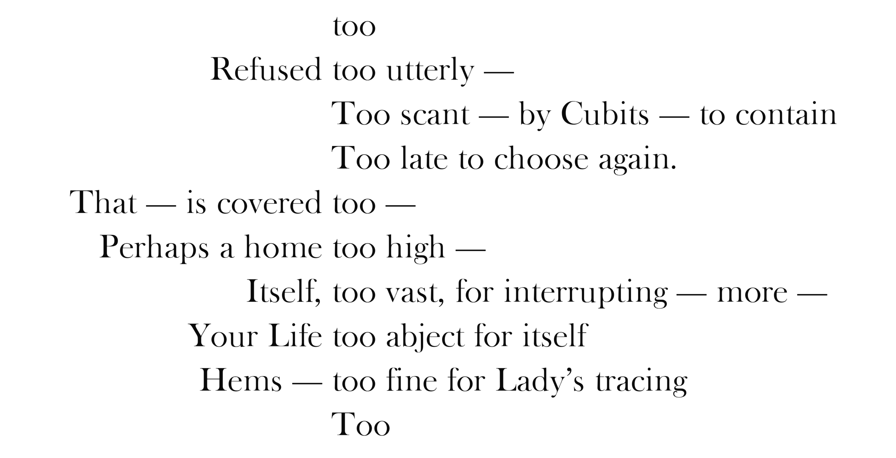
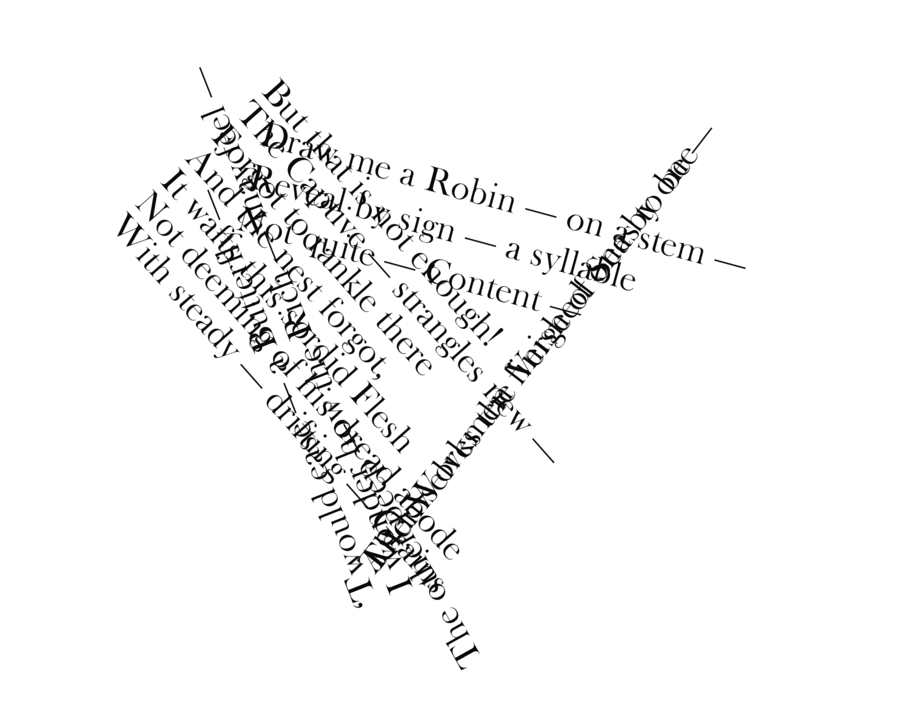

# PoetryChains

Poetry Chains was featured in [Hybridity and Synesthesia](http://www.lydgalleriet.no/archive/hybridity-and-synaesthesia) at [Lydgalleriet](http://www.lydgalleriet.no/) in Bergen, Norway, as part of the [Electronic Literature Organization 2015](http://eliterature.org/).

A online version based on Emily Dickinson's poems can be found at:
[http://poetrychains.soe.ucsc.edu:8766/](http://poetrychains.soe.ucsc.edu:8766)

---

---

---

1. To install locally...

> npm install

cd app

> npm install

cd ..

> npm install coffee-script -g

2. To run locally...

> nodemon index.coffee

> coffee index.coffee

(will open up port 8888 on localhost, defaults to looping through all 4 animations, starting with the chain visualization)

3. To specify a particular animation...

http://localhost:8888/#colocation

http://localhost:8888/#lines

http://localhost:8888/#chain

http://localhost:8888/#howe

